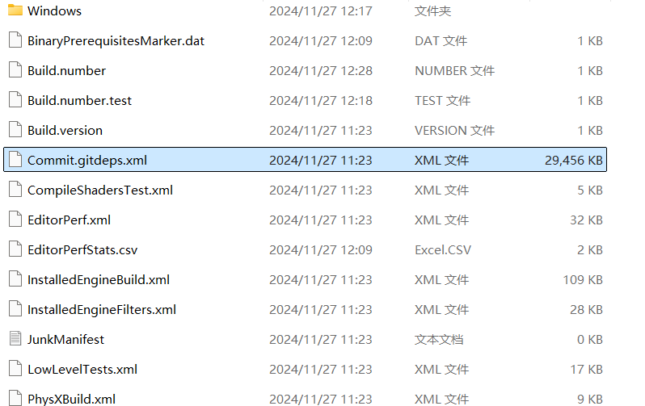

# Unreal Engine 5.0.3 Setup

## Install

### STEP 1: Clone WiTracing Unreal Engine Project.
Unreal Engine is a private project and is only visible to its subscribers. First, We need to associate the GitHub account with our UE account. 
For the step for account association, please refer to [How do I link my Unreal Engine account with my Github account?](https://www.epicgames.com/help/en-US/epic-accounts-c5719348850459/connect-accounts-c5719351300507/how-do-i-link-my-unreal-engine-account-with-my-github-account-a5720369784347)

